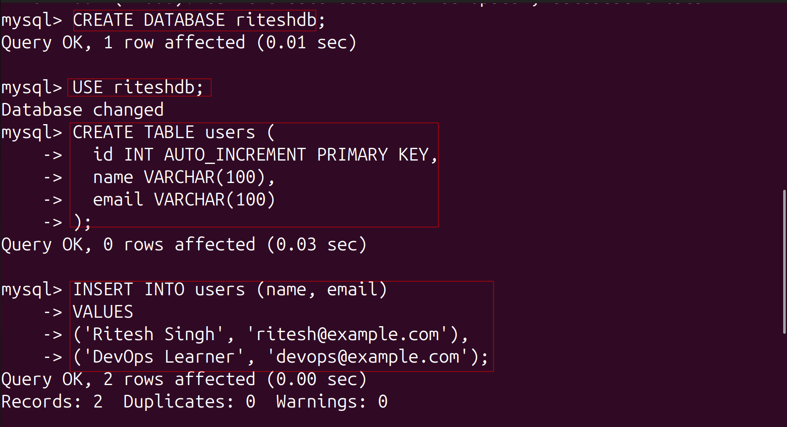
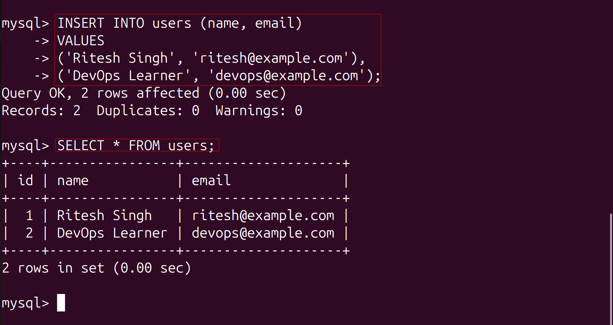
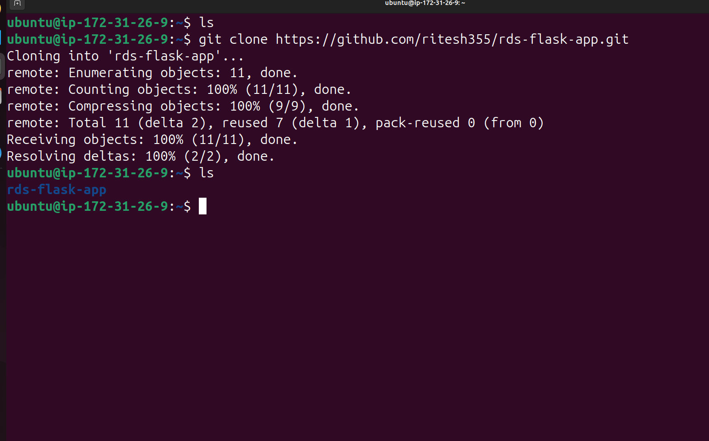
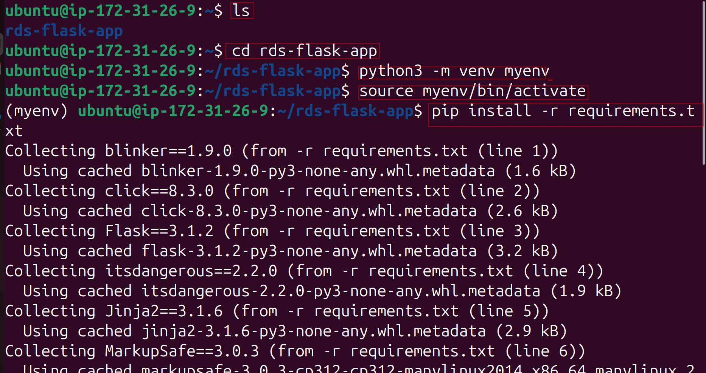
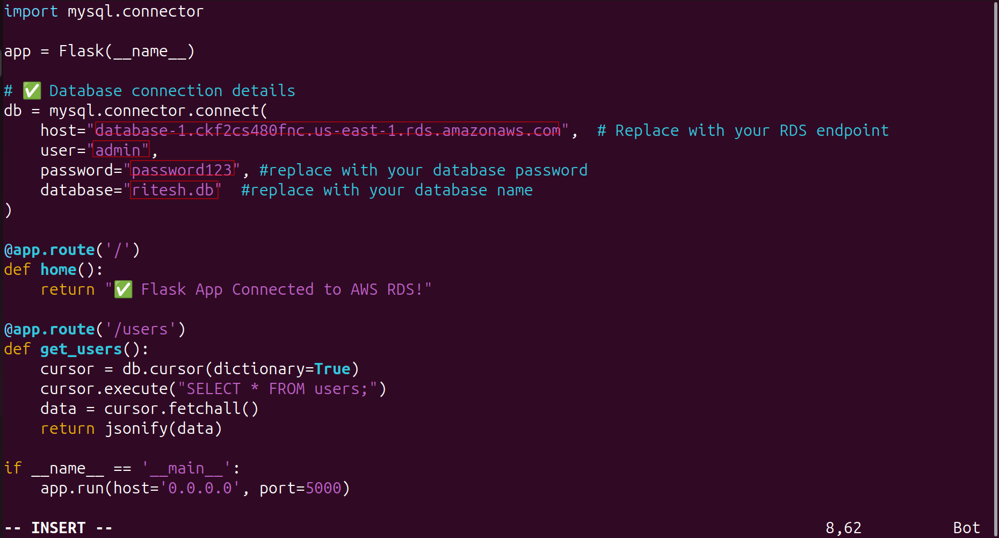

# Flask App with AWS RDS (MySQL)

A simple Flask web application connected to an AWS RDS MySQL database, demonstrating real-world DevOps and Cloud integration.

---

## 🧠 Project Overview

This project shows how to:
- Host a web application on AWS EC2.
- Connect it securely to a managed MySQL database on AWS RDS.
- Display data from the database using a Flask REST API.

---

## ⚙️ Tech Stack
- **AWS EC2** – Web server
- **AWS RDS (MySQL)** – Managed database
- **Flask** – Web framework
- **Python** – Application language

---

## 🪜 Setup Instructions

## 1️⃣ Create RDS MySQL Database
### 🧪 Step 1: Open RDS Service
1. Sign in to the **AWS Management Console**.  
2. Search for **RDS** and open it.
3. Click **Create database**.
   

---

### 🧱 Step 2: Choose Database Creation Method
- **Method:** Standard create  
- **Engine type:** MySQL
- 
- **Version:** Latest supported version (e.g., MySQL 8.x)  

---

### ⚙️ Step 3: Choose a Template
- **Template:** Free tier (if not visible, select `Production` and use `db.t3.micro`) if in you set up free option is avalable then go for it ..
-   

---

### 🗝️ Step 4: Set DB Instance Details
- **DB instance identifier:** `myrds-db`  
- **Master username:** `admin`  
- **Master password:** Choose a secure password (e.g., `MyRDS@12345`)  
- Confirm password
- 

---

### 💾 Step 5: Configure Instance
- **DB instance class:** `db.t3.micro`  
- **Storage:** 20 GB (default)  
- **Storage autoscaling:** enabled (optional)
- 

---

### 🌐 Step 6: Connectivity
1. **VPC:** default VPC  
2. **Public access:** Yes  
3. **VPC security group:** Create new → `mysql-sg`
   
     !


---

### 🧰 Step 7: Additional Configuration
- **Initial database name:** `devopsdb`  
- **Backup retention:** 1 day  
- **Monitoring:** optional  
- **Deletion protection:** disable  
   

Click **Create database** 🟢  
> Wait 5–10 minutes until status shows **Available**.

---

## 🔹 Step 8: Configure Security Group Access

### 1️⃣ EC2 Security Group
- Go to **EC2 → Instances → your instance → Security → Security groups**  
- Note the EC2 security group (e.g., `mysql-sg`)  
   

### 2️⃣ RDS Security Group
- Go to **EC2 → Security Groups → rds-sg**  
- **Inbound rules:**  
  | Type          | Protocol | Port | Source           |
  |---------------|---------|------|-----------------|
  | MySQL/Aurora  | TCP     | 3306 | EC2 security group (`mysql-sg`) |
  |SSH            | TCP     |22 | enboundrule|

> This allows the EC2 instance to connect to RDS.


---

## 🔗 Step 9: Connect to RDS

### For Ubuntu EC2:
1. Update packages:
```bash
sudo apt update
```

2. Install MySQL client:
```bash
sudo apt install mysql-client -y
```
   


3. Connect to your RDS instance:
```bash
mysql -h <RDS-ENDPOINT> -u admin -p
```
- Replace <RDS-ENDPOINT> with your RDS endpoint
-    


- Enter the password you created
-    

## 🪜 Next Steps: Create a Database, Table, and Insert Sample Data
### Step 1: Create a new database

Inside the MySQL shell (you’re already in), run:
```sql
CREATE DATABASE riteshdb;
```
### Step 2: Switch to the new database
```sql
USE riteshdb;
```


### Step 3: Create a sample table
```sql
CREATE TABLE users (
  id INT AUTO_INCREMENT PRIMARY KEY,
  name VARCHAR(100),
  email VARCHAR(100)
);
```

### Step 4: Insert sample data
```sql
INSERT INTO users (name, email) 
VALUES 
('Ritesh Singh', 'ritesh@example.com'),
('DevOps Learner', 'devops@example.com');
```
### Step 5: Verify data
```sql
SELECT * FROM users;
```


### 1️⃣ Clone the Repository
```bash
git clone https://github.com/<your-username>/rds-flask-app.git
cd rds-flask-app
```


### 2️⃣ Create & Activate Virtual Environment
```bash
python3 -m venv myenv
source myenv/bin/activate   # On Windows: myenv\Scripts\activate
```


### 3️⃣ Install Dependencies
```bash
pip install -r requirements.txt
```
### 4️⃣ Configure Database Connection

Open app.py and update your RDS details:
```python

db = mysql.connector.connect(
    host="database-1.ckf2cs480fnc.us-east-1.rds.amazonaws.com",  # Replace with your RDS endpoint
    user="admin",
    password="your_rds_password_here",
    database="riteshdb"
)
```



### 5️⃣ Run the Flask App
```python
python app.py
```

The app will run on port 5000 by default:
```
http://127.0.0.1:5000/
```
Perfect! 🎉 Your Flask app is running on your  **EC2 public IP:5000** and is connected to your app.

**Open in browser:**
```
http://<EC2_PUBLIC_IP>:5000/users
```
You should see JSON output like:
```
[
  {"id": 1, "name": "Ritesh Singh", "email": "ritesh@example.com"},
  {"id": 2, "name": "DevOps Learner", "email": "devops@example.com"}
]
```

### THANKS


